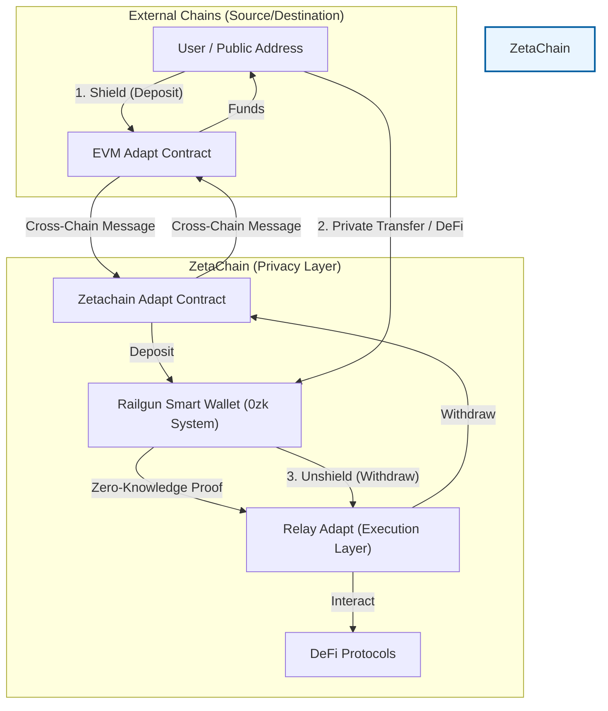

# Universal Private

  

**Universal Private** is a revolutionary universal privacy solution built on [ZetaChain](https://www.zetachain.com/) and [RAILGUN](https://railgun.org/). It enables **cross-chain privacy transactions**, allowing users to interact with DeFi protocols, privacy pools, and transfers across any chain while maintaining complete anonymity.

We integrate the Railgun privacy system with ZetaChain's omnichain capabilities to create a unified privacy layer. This repository contains the core contracts, a web frontend demo, a backend/testing suite, and the **Universal Private SDK** for developers.

## 🌟 Key Features

*   **Universal Privacy**: Perform private transactions on any supported chain.
*   **Cross-Chain Shielding**: Move funds from Ethereum, BSC, Base, Arbitrum, Avalanche, Polygon, and more directly into the Railgun privacy system on ZetaChain.
*   **0zk Address**: Create a Zero-Knowledge address (0zk) to hold and manage funds privately.
*   **Private DeFi**: Interact with DeFi protocols (Swap, Liquidity Provision) anonymously.
*   **Unshield Anywhere**: Withdraw funds from your privacy account to a public address on any supported chain.
*   **Developer SDK**: A comprehensive Typescript SDK to integrate Universal Private features into your own dApps and wallets.

## 🏗 Architecture

Universal Private leverages **ZetaChain** for cross-chain messaging and interoperability, and **Railgun** for zero-knowledge privacy.



## 📂 Project Structure

*   `contract/`: Smart contracts including `ZetaChainAdapt` (ZetaChain) and `EVMAdapt` (Other EVM chains).
*   `frontend/`: A Next.js Web Application demonstrating the full capabilities of Universal Private.
*   `test/`: Node.js scripts for backend testing and command-line usage demos.
*   `frontend/packages/sdk/`: The **Universal Private SDK** source code.

## 🚀 Getting Started

### Prerequisites

*   **Node.js** (v18 or higher recommended)
*   **pnpm** (for frontend)
*   **npm** (for test scripts)

### Installation

1.  **Clone the repository**:
    ```bash
    git clone https://github.com/your-username/universal-private.git
    cd universal-private
    ```

2.  **Run the Web Demo**:
    ```bash
    cd frontend
    pnpm install
    pnpm dev
    ```
    Open [http://localhost:3000](http://localhost:3000) in your browser.

    > **Note**: The Web Demo creates a client-side wallet. You can generate a 0zk address using a mnemonic.

3.  **Run Node.js Tests/Backend**:
    ```bash
    cd test
    npm install
    # Run specific tests
    npm run test
    ```
    This folder contains scripts to programmatically interact with the Shield, Unshield, and Transfer functions.

## 📦 Universal Private SDK

We provide a powerful SDK for developers to build privacy-enabled applications. The SDK supports both Node.js and Web environments.

### Installation

```bash
npm install universal-private-sdk
# OR
pnpm add universal-private-sdk
```
*(Note: Replace `universal-private-sdk` with the actual package name if different)*

### Basic Usage

**Shielding Funds (Cross-Chain Deposit)**
```typescript
import { Shield } from 'universal-private-sdk';

// Initialize Shield
const shield = new Shield(provider, config);

// Shield funds from Sepolia to ZetaChain Railgun 0zk Address
await shield.deposit({
  token: 'USDC',
  amount: '100',
  to: 'source-chain-address',
  target: '0zk...', // Your Railgun 0zk Address
});
```

**Private Transfer**
```typescript
import { Transfer } from 'universal-private-sdk';

// Transfer encrypted assets between 0zk addresses
await transfer.send({
  token: 'USDC',
  amount: '50',
  to: '0zk-recipient-address',
});
```

## 🔒 Advanced Privacy (Waku & Broadcaster)

For maximum privacy, we recommend using **Waku** and **Broadcasters**.

*   **Broadcaster (Relayer)**: execute "gasless" meta-transactions. Users verify proofs and sign transactions without spending their own gas or revealing their IP directly to the blockchain node. This also removes the need for cross-chain message fees on the user side when operating on ZetaChain.
*   **Waku**: A decentralized communication layer that hides your IP address by routing messages through a p2p network before reaching the Broadcaster.

*See [Railgun Privacy System Docs](https://docs.railgun.org/wiki/learn/privacy-system/community-broadcasters) for configuration details.*

> **Note**: The current Web Demo executes transactions directly for simplicity. Developers using the SDK can enable Broadcaster/Waku support in the configuration.

## 🌐 Supported Networks (Testnet)

Currently live on Testnets:
*   **ZetaChain Athens 3** (Hub)
*   **Ethereum Sepolia**
*   **Base Sepolia**
*   **Arbitrum Sepolia**
*   **BSC Testnet**
*   **Avalanche Fuji**
*   **Polygon Amoy**
*   **Kaia Testnet**

**Future Roadmap**:
*   Mainnet Launch
*   Non-EVM Chain Support: **Solana**, **Sui**, **TON**.

## 🤝 Contributing

Contributions are welcome! Please feel free to submit a Pull Request.

## 📄 License

This project is licensed under the MIT License.
