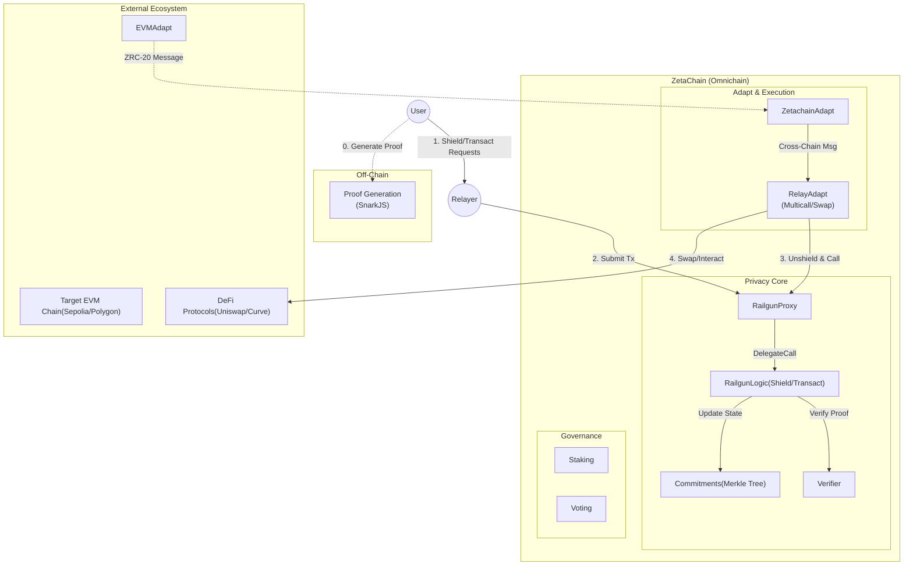
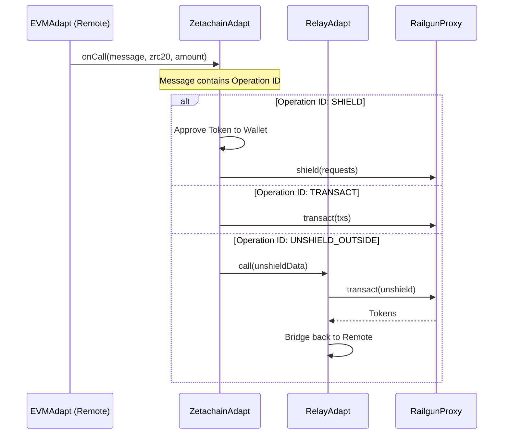
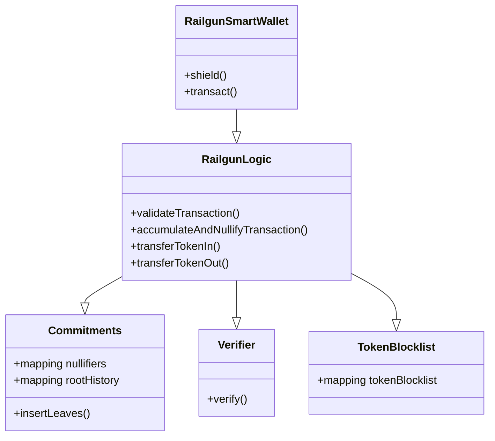
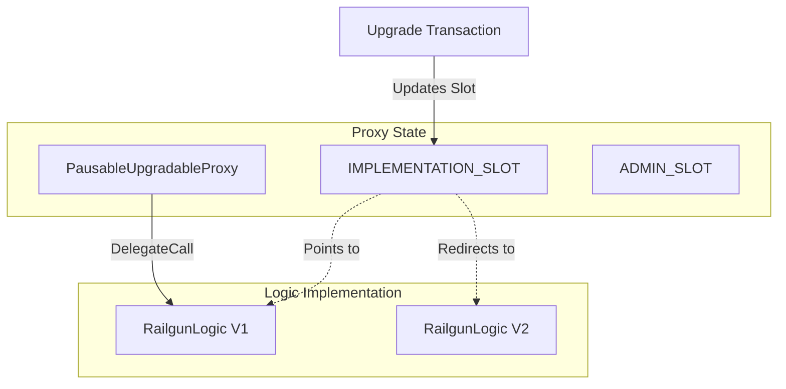
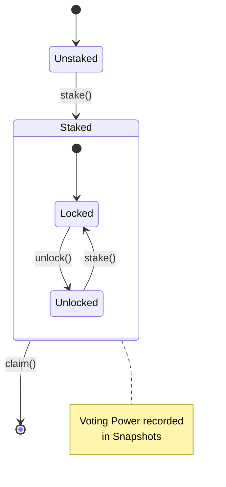

# RAILGUN Contracts

## Getting started

- Install Node.js - using [nvm](https://github.com/nvm-sh/nvm) is recommended
- Run `npm i` to install dependencies
- (Optional) Setup hardhat local network config in `~/.hardhat/networks.{js|ts|json}` following the [hardhat-local-networks-config-plugin](https://github.com/facuspagnuolo/hardhat-local-networks-config-plugin) format.
- (Optional) Install `hardhat-shorthand` to use `hh` commands.
- Run `hh help` or `npx hardhat help` for list of commands


### System Architecture

This section details the internal architecture of the Railgun Privacy System on ZetaChain, verified against the actual smart contract codebase.

#### 1. Global System Architecture

A high-level view of how the Railgun privacy protocol integrates with the broader ecosystem, including Users, Relayers, Cross-Chain adapters, and DeFi protocols.



#### 2. ZK Private Transaction Flow

The detailed lifecycle of a private transaction (`transact`), identifying how Zero-Knowledge proofs are verified and how nullifiers prevent double-spending.

```mermaid
sequenceDiagram
    participant U as User
    participant R as Relayer
    participant W as RailgunSmartWallet
    participant L as RailgunLogic
    participant V as Verifier
    participant S as Snark Library

    Note over U: 1. Off-Chain
    U->>U: Generate Random & Blinding
    U->>U: Construct UTXO Circuit Inputs
    U->>U: Generate Groth16 Proof (Proof, PublicInputs)

    U->>R: Submit Transaction Payload
    R->>W: transact(Transaction[])

    Note over W: 2. On-Chain Execution
    W->>L: validateTransaction(tx)
    
    rect rgb(20, 20, 20)
    Note right of L: Verification Phase
    L->>L: Check Nullifiers (Double Spend)
    L->>L: Check Merkle Root History
    L->>V: verify(tx)
    V->>V: Hash BoundParams -> Input[1]
    V->>S: verify(vk, proof, inputs)
    S->>S: Elliptic Curve Pairing Check
    S-->>V: Valid / Invalid
    V-->>L: Transaction Valid
    end

    rect rgb(20, 20, 20)
    Note right of L: State Update Phase
    L->>L: accumulateAndNullifyTransaction()
    L->>L: Mark Nullifiers as SPENT
    L->>L: Add New Commitments (Notes)
    L->>W: State Updated
    end
    
    W->>W: emit Transact(Event)
```



#### 3. RelayAdapt DeFi Interaction

**RelayAdapt** enables private interaction with public DeFi. It atomically unshields funds, performs arbitrary actions (swaps, bridges), and re-shields the results.

```mermaid
sequenceDiagram
    participant User
    participant RelayAdapt
    participant Wallet as RailgunProxy
    participant Uniswap

    Note over User: User signs "Adapt Action"\n(Swap Tokens)
    
    User->>RelayAdapt: relay(transactions, actionData)
    
    rect rgb(30, 30, 30)
    Note right of RelayAdapt: 1. Unshield Step
    RelayAdapt->>Wallet: transact(unshieldTxs)
    Note over Wallet: Verify ZK Proof
    Wallet->>RelayAdapt: Transfer ERC20 (Public)
    end

    rect rgb(30, 30, 30)
    Note right of RelayAdapt: 2. Execution Step (Multicall)
    RelayAdapt->>Uniswap: swapExactTokensForTokens()
    Uniswap-->>RelayAdapt: Output Tokens
    end

    rect rgb(30, 30, 30)
    Note right of RelayAdapt: 3. Re-Shield Step
    RelayAdapt->>Wallet: shield(shieldRequests)
    Wallet->>Wallet: Add to Merkle Tree
    Note left of Wallet: Funds are now Private again
    end
```



#### 4. Adapt Layer (Cross-Chain Flow)

How `ZetachainAdapt` handles incoming cross-chain messages and routes them to the privacy system.



#### 5. Smart Contract Structure

The core inheritance hierarchy ensuring modularity and separation of concerns.



#### 6. Proxy Storage Pattern

Uses **EIP-1967** storage slots to separate Logic from State, allowing `RailgunLogic` to be upgraded while preserving the Merkle Tree and User Balances.



#### 7. Staking & Governance



### Deploy Railgun on Zetachain

Deploys the complete Railgun system (Railgun Smart Wallet, RelayAdapt, ZetachainAdapt) on ZetaChain.

Refer from https://www.zetachain.com/docs/reference/network/contracts

```bash
npx hardhat deploy:railgun \
  --network zetachain-testnet \
  --weth9 0x5F0b1a82749cb4E2278EC87F8BF6B618dC71a8bf \
  --zetachaingateway 0x6c533f7fe93fae114d0954697069df33c9b74fd7 \
  --uniswaprouter 0x2ca7d64A7EFE2D62A725E2B35Cf7230D6677FfEe
```

### Deploy ZetachainAdapt on Zetachain

If you need to deploy ZetachainAdapt separately (e.g., redeployment or upgrade):

```bash
npx hardhat deploy:zetachainAdapt --network zetachain-testnet
```

The script will automatically load addresses from `deployments/zetachain-testnet.json`:
- `--railgun`: From `contracts.RailgunProxy.address`
- `--relayadapt`: From `contracts.RelayAdapt.address`
- `--uniswaprouter`: From `externalContracts.UniswapRouter`

You can also manually specify any or all parameters to override the deployment config.

### Deploy evmAdapt on Sepolia

```bash
npx hardhat deploy:evmAdapt \
  --gatewayevm 0x0c487a766110c85d301d96e33579c5b317fa4995 \
  --network sepolia
```

The script will automatically load the ZetachainAdapt address from `deployments/zetachain-testnet.json`:
- `--zetachainadapt`: From `contracts.ZetachainAdapt.address`

You can also manually specify the parameter to override the deployment config.

## Deployment Management

### Check Deployed Contracts

After deployment, **always verify** all contracts are deployed correctly:

```bash
# Check contracts on ZetaChain testnet
npx hardhat run deployments/check_deployments.js --network zetachain-testnet

# Check contracts on Sepolia
npx hardhat run deployments/check_deployments.js --network sepolia
```

In testing, contracts deployed successfully on-chain but didn't appear on Blockscout for 30+ minutes. The check script immediately confirmed deployment.

### Deployment Records

All deployment addresses are automatically saved to `deployments/` directory:
- `zetachain-testnet.json` - ZetaChain Athens Testnet
- `sepolia.json` - Ethereum Sepolia Testnet

Each deployment file contains:
- Contract addresses
- Verification status
- Block explorer links
- Deployment metadata (timestamp, deployer, chain ID)

See [deployments/README.md](deployments/README.md) for more details.

### Important Addresses

After deployment, use these addresses for interactions:

- **RailgunProxy**: Main contract for all Railgun operations (upgradeable)
- **RelayAdapt**: Handles multicall operations with Railgun
- **ZetachainAdapt**: Cross-chain adapter for ZetaChain messages

Example (from latest ZetaChain testnet deployment):
```json
{
  "RailgunProxy": "0x1bdFD03a41a3E55d3De49A27231ABEFf2dE25a55",
  "RelayAdapt": "0x92De3D52a9f77c0dfF23c4E367604205F4028DE7",
  "ZetachainAdapt": "0xf8fb7e368A086D09CA35FfDE5f1F38600a6b0420"
}
```

Check `deployments/zetachain-testnet.json` for the complete list.

