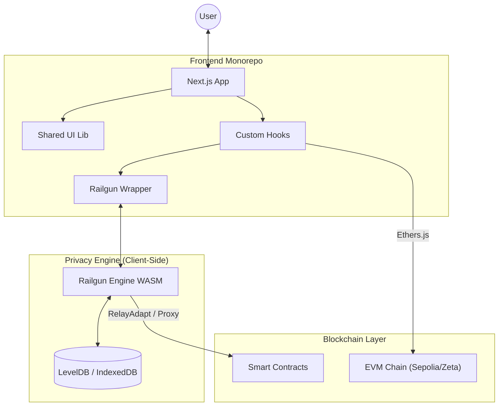
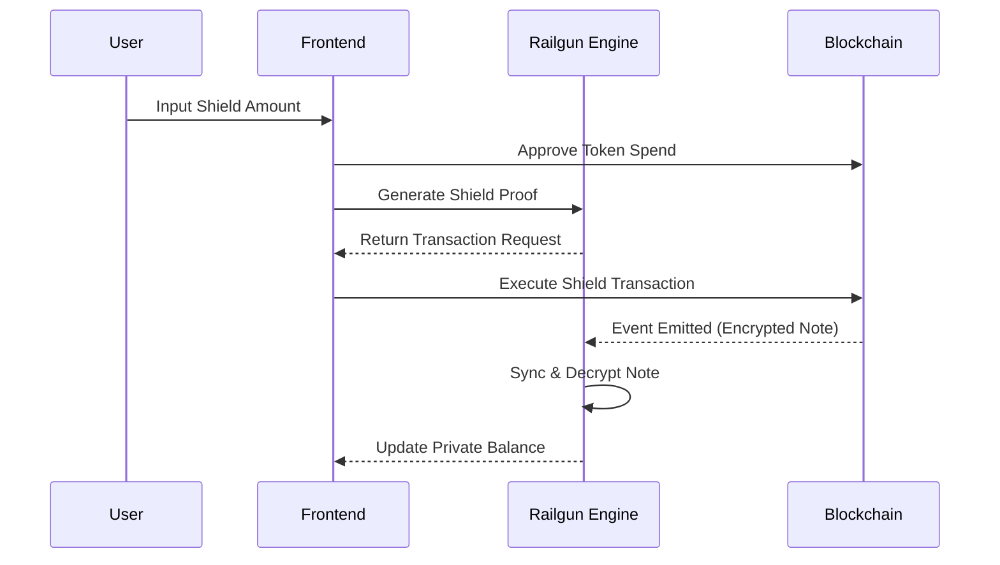

# Universal Private (Frontend) - Architecture Guide 🏗️

Welcome to the **Universal Private Frontend** architecture documentation. This guide aims to provide a comprehensive understanding of the system, from high-level design decisions to low-level implementation details.

---

## 1. High-Level Overview (Macro Architecture)

This project uses a **Monorepo** architecture, managed efficiently with **Turborepo** workspaces. The core goal is to provide a privacy-preserving blockchain interface leveraging the **Railgun Privacy System**.

### 1.1 Technology Stack

*   **Monorepo Management**: [Turborepo](https://turbo.build/)
*   **Package Manager**: [pnpm](https://pnpm.io/)
*   **Frontend Framework**: [Next.js 16](https://nextjs.org/) (App Router)
*   **Language**: TypeScript
*   **Privacy Engine**: [@railgun-community/wallet](https://www.npmjs.com/package/@railgun-community/wallet) (Zero-knowledge proof generation)
*   **Blockchain Interaction**: [Ethers.js v6](https://docs.ethers.org/)
*   **UI/Styling**: [Tailwind CSS](https://tailwindcss.com/) + [Radix UI](https://www.radix-ui.com/) + [Shadcn](https://ui.shadcn.com/)
*   **Testing Framework**: [Vitest](https://vitest.dev/)

### 1.2 Core Principals

1.  **Privacy First**: All core transactions (Shield, Transfer) are processed client-side to generate zero-knowledge proofs. Sensitive private keys **never** leave the browser.
2.  **Logic/UI Separation**: Business logic is encapsulated in Custom Hooks (`hooks/`), keeping UI components (`components/`) pure and focused on presentation.
3.  **Config Driven**: Network parameters, fees, and contract addresses are centrally managed in `config/env.ts`, avoiding Magic Numbers scattered in code and simplifying multi-chain support.

---

### 1.3 High-Level Architecture Diagram



## 2. Directory Structure

The codebase is organized as follows:

```bash
root/
├── apps/
│   └── web/                 # Main frontend application (Next.js)
│       ├── app/             # App Router (Pages & Layouts)
│       ├── components/      # UI Components (Presentation Layer)
│       ├── hooks/           # Business Logic (React Hooks)
│       ├── lib/             # Core libraries (Railgun wrapper, Storage, etc.)
│       └── config/          # Centralized configuration
├── packages/
│   ├── ui/                  # Shared UI Library (Button, Dialog, Toast)
│   ├── eslint-config/       # Shared Lint Rules
│   └── typescript-config/   # Shared TSConfigs
├── turbo.json               # Pipeline Configuration
└── package.json             # Root Scripts
```

---

## 3. Core Systems & Flows

### 3.1 Authentication & Wallet Management

The system adopts a **Two-Tier Authentication** model:
1.  **EVM Wallet (Public)**: Connected via `useWallet` (e.g., MetaMask). Used for public interactions (like Approve) and signing Shield requests.
2.  **Railgun Wallet (Private)**: Managed via `useRailgun`. Requires a password to derive the `Encryption Key`.
    *   **Session State**: The derived `Encryption Key` is stored only in React Context (Memory). For security, it is **NEVER** persisted to LocalStorage.
    *   **Auth Guard**: Critical pages (like `/cross-chain`) check if this Key exists; if missing, redirects to the login page.

### 3.2 Privacy Engine Lifecycle (`lib/railgun`)

The Railgun Engine is a heavy background process involving WASM.
*   **Initialization**: Lazy-loaded via `useRailgunEngine` at app startup.
*   **Database**: Uses `level-js` (IndexedDB) to store Merkle Tree sync state on the client side.
*   **Core Transactions**:
    *   **Shield**: `apps/web/lib/railgun/shield.ts` - Converts public ERC20 to private Notes.
    *   **Transfer**: `apps/web/lib/railgun/transfer.ts` - Private transfers (0zk -> 0zk).
    *   **Cross-Chain**: `apps/web/lib/railgun/cross-chain-transfer.ts` - Complex flow involving Unshield + Cross-contract calls.
    *   **DeFi Operations**: `apps/web/lib/railgun/liquidity.ts` - Private DeFi operations, interacting with DEX protocols (e.g., Add Liquidity, Swap) via RelayAdapt's multicall functionality.

#### 3.2.1 Data Flow Diagram



### 3.3 State Management

We avoid heavy global state libraries (Redux/Zustand) in favor of **Context + Hooks**:
*   **Global**: `RailgunProvider`, `WalletProvider`, `ConfirmDialogProvider`.
*   **Local**: Form state (React `useState`).
*   **Feedback**: Using `sonner` Toast for asynchronous operation status feedback.

### 3.4 Micro Architecture Detail

This section details the specific responsibilities of core directories under `apps/web`.

#### 1. `components/cross-chain/` (Business Components)
These are business components designed specifically for "Cross-Chain Privacy" pages, not generic UI.
*   **`header.tsx`**: Top status bar. Displays current connected network (supports all configured chains, including ZetaChain), wallet connection button, and Railgun address. Provides network switching dropdown to switch to any configured testnet.
*   **`shield-form.tsx`**: "Deposit" form. Collects user input (Token, Amount) and calls `useShieldTransaction` to convert public tokens to private tokens (Shield).
*   **`transfer-form.tsx`**: "Private Transfer/Cross-Chain" form. Collects recipient and amount, handles 0zk -> 0zk transfer or Unshield cross-chain operations.
*   **`liquidity-form.tsx`**: "DeFi Operations" form. Implements multi-stage operation flow with unified card design style (black border, white background, shadow):
    1.  **Stage 1 (Category)**: DeFi function selection page, showing "Liquidity Management" (clickable) and "Coming Soon" hints. All cards use unified design.
    2.  **Stage 2 (Pool Selection)**: Pool selection interface. Automatically queries and displays all available liquidity pools from Uniswap V2 Factory. Auto-fills token pair info after selection. Pool cards use unified black border and shadow style. Supports pool caching for faster loading.
    3.  **Stage 3 (Liquidity Management)**: Unified liquidity management interface, including:
        - **Pool Info**: Displays selected pool info (unified card style).
        - **LP Position**: If user has LP tokens in the pool, displays balance, pool share, and extractable token amounts.
        - **Tabs**: "Add Liquidity" and "Remove Liquidity" tabs.
        - **Add Liquidity Form**:
          *   **Price Display**: Top of form, displays current pool price (Two-way: A→B and B→A), unified card style.
          *   **Token Input**: Two large input boxes, each displaying balance and MAX button in header.
          *   **Visual Connection**: "+" icon (black border, white background, shadow) between inputs indicates pairing.
          *   **Auto-Calculation**: Always enabled. Automatically calculates the other token amount based on current pool price (enforces constant product formula).
        - **Remove Liquidity Form**:
          *   **LP Token Input**: Input amount of LP tokens to remove, supports MAX button.
          *   **Expected Output**: Calculates and displays expected token amounts based on input LP token amount.
          *   **Precision Verification**: Uses BigInt for precise verification to avoid floating-point errors.
        - **Pool Details**: Bottom of form, collapsible `<details>` element containing reserves, total LP supply, user liquidity, etc.
        - **Multi-Chain Support**: Executes directly on ZetaChain, or via EVMAdapt forwarding on other EVM chains.

#### 2. `components/providers/` (Global Context)
The "spine" of the application, managing global singleton states.
*   **`wallet-provider.tsx`**: Wraps Ethers.js `BrowserProvider`. Manages MetaMask connection, Chain ID listening, and network switching.
*   **`railgun-provider.tsx`**: Manages Railgun Wallet lifecycle.
    *   `login(password)`: Verifies password and sets Session Key.
    *   `walletInfo`: Currently loaded Railgun wallet info (ID, Address).
*   **`confirm-dialog-provider.tsx`**: Provides `useConfirm` hook. Allows invoking a Promise-based confirmation window anywhere (including inside Hooks).

#### 3. `hooks/` (Logic Core)
The "brain" where all side effects and complex calculations occur.
*   **`use-shield-tx.ts`**: Encapsulates Shield flow.
    *   Auto-checks Allowance.
    *   Distinguishes Cross-Chain Shield (Sepolia -> Zeta) vs Local Shield.
*   **`use-transfer-tx.ts`**: Encapsulates Transfer flow.
    *   Generates Zero-Knowledge Proof (computationally intensive).
    *   Constructs Cross-Chain Unshield Transaction.
*   **`use-liquidity-tx.ts`**: Encapsulates DeFi operation flow.
    *   Handles complete logic for adding and removing liquidity.
    *   Interacts with DEX contracts via RelayAdapt's multicall functionality.
    *   Ensures tokens are correctly withdrawn from Railgun privacy pool and provided to liquidity pool (Add), or removed from liquidity pool and returned to Railgun privacy pool (Remove).
    *   Supports multi-chain operations: Automatically determines current chain type, executing directly on ZetaChain or via EVMAdapt on other chains.
    *   Validates token addresses, amounts, LP Token balances, calculates slippage protection (default 5%), handles errors and Toast notifications.
    *   Provides `executeAddLiquidity` and `executeRemoveLiquidity` functions.
*   **`use-network-sync.ts`**: Ensures URL routing matches current wallet network.
*   **`use-railgun-auto-scan.ts`**: Background hook, periodically triggers balance scanning and Merkle Tree rebuilding.

#### 4. `lib/railgun/` (SDK Wrapper Layer)
Low-level code interacting directly with `@railgun-community/*` SDK, isolating SDK complexity.
*   **`wallet.ts` / `wallet-actions.ts`**: Wallet creation, loading, mnemonic management.
*   **`shield.ts`**: Implementation of Shield Transaction construction (Ethers Contract calls).
*   **`transfer.ts`**: Construction of 0zk -> 0zk Proof and Transaction.
*   **`cross-chain-transfer.ts`**: Most complex file. Handles:
    1.  Generating Unshield Proof (Private -> Public).
    2.  Constructing call to `ZetachainAdapt` contract (Asset transfer).
    3.  Constructing call to `EVMAdapt`'s `unshieldOutsideChain`.
*   **`liquidity.ts`**: DeFi operation wrapper. Responsible for:
    1.  **Add Liquidity**:
       *   Generate Unshield Proof to withdraw tokens from Railgun privacy pool.
       *   Construct call to DEX contract (e.g., Uniswap V2 Router `addLiquidity`).
       *   Complete Unshield + Approve + addLiquidity in a single transaction via RelayAdapt multicall.
       *   Handle token pair ratio calculation and slippage protection (default 5%).
    2.  **Remove Liquidity**:
       *   Generate Unshield Proof to withdraw LP tokens from Railgun privacy pool.
       *   Construct call to DEX contract (e.g., Uniswap V2 Router `removeLiquidity`).
       *   Complete Unshield + Approve + removeLiquidity in a single transaction via RelayAdapt multicall.
       *   Handle fee calculation and slippage protection.
    3.  **Multi-Chain Support**:
       *   Execute `executeAddLiquidity` / `executeRemoveLiquidity` directly on ZetaChain.
       *   Execute via `executeAddLiquidityFromEvm` / `executeRemoveLiquidityFromEvm` on other EVM chains.
*   **`uniswap-pools.ts`**: Uniswap pool query tool. Responsible for:
    1.  Querying liquidity pool addresses and details from Uniswap V2 Factory.
    2.  Fetching token pairs, reserves, total supply, etc., from pools.
    3.  Generating common token pair lists (WZETA and other tokens).
    4.  Batch querying pool info for pool selection display.
*   **`pools-cache.ts`**: Pool cache management tool. Responsible for:
    1.  Providing two-layer cache mechanism (Memory cache + LocalStorage persistence).
    2.  Cache expiration management (Default 5 minutes).
    3.  Isolating cache data by Chain ID to support multi-chain environment.
    4.  Improving pool list loading speed and reducing unnecessary on-chain queries.
*   **`db.ts`**: Configures LevelDB for storing encrypted data.

---

## 4. UI Architecture

UI is modularized into `packages/ui` for potential reuse.
*   **Design System**: Brutalist/Minimalist style.
*   **Components**: Built on Radix UI primitives, ensuring Accessibility.
*   **Unified Card Style**: All card components use unified design style:
    *   `border-2 border-black` - Black border (2px)
    *   `bg-white` - White background
    *   `rounded-lg` - Rounded corners
    *   `shadow-[2px_2px_0px_0px_rgba(0,0,0,1)]` - Black shadow effect
    *   Interactive cards support hover effects: `hover:bg-gray-50` and `hover:shadow-[3px_3px_0px_0px_rgba(0,0,0,1)]`
*   **Modification Guide**:
    1.  Modify reusable primitives: `packages/ui/src/components`.
    2.  Modify business-specific components: `apps/web/components`.

---

## 5. Developer Guide

### 5.1 Prerequisites
*   **Node.js**: >= 18
*   **pnpm**: >= 9 (Recommended package manager)
*   **Git**

### 5.2 Installation

```bash
# 1. Clone
git clone <repo-url>
cd UniversalPrivate

# 2. Install Dependencies (Root)
pnpm install

# 3. Download Railgun Artifacts (postinstall script should handle this automatically)
# Usually handled by `patch-package` or `pnpm copy-artifacts` inside apps/web
```

### 5.3 Running Locally

```bash
# Start Development Server (Next.js at localhost:3000)
pnpm dev
```

### 5.4 Testing

We use **Vitest** for unit testing. Since this is a Monorepo, test commands need to be run via `pnpm` filter or `turbo` pipeline. **Do NOT run `vitest` directly in the root directory, as the package is only installed in the `apps/web` workspace.**

#### Why run it this way?
Monorepo isolates different projects (apps/packages). The root `node_modules` usually doesn't contain dev dependencies of sub-projects (like vitest). So we must tell pnpm to "go inside apps/web and run the test command".

#### Common Commands

**1. Run All Tests (Recommended)**
This runs tests for all workspaces via TurboRepo:
```bash
pnpm test
```

**2. Run Only Web Frontend Tests**
If you only want to run frontend tests, skipping other packages:
```bash
pnpm --filter web test
```

**3. Run Specific Test File (Most used during dev)**
If you are developing Cross-Chain features and only want to run related tests:
```bash
# Format: pnpm --filter <workspace_name> test -- <file_path>
pnpm --filter web test -- lib/railgun/cross-chain-check.test.ts
```

#### Mocking Explanation
Some core libraries (like `ethers`) cannot run directly in unit test environments (due to network or WASM).
We created manual Mocks in `apps/web/__mocks__`:
*   `ethers.ts`: Mocks core functions like Contract, Provider, and parseUnits, allowing tests to focus on verifying business logic flow.

---

## 6. Deployment

The application is optimized for Vercel deployment but also supports Dockerization.

### 6.1 Vercel Deployment
1.  **Build Command**: `pnpm build` (Root scope, triggers turbo build).
2.  **Output Directory**: `apps/web/.next` (Next.js default).
3.  **Environment Variables**: Ensure they match `.env.example`.
    *   `NEXT_PUBLIC_CHAIN_ID`
    *   `NEXT_PUBLIC_RPC_URL`

### 6.2 Manual Build

```bash
# Clean and Build
pnpm build

# Start Service
cd apps/web
pnpm start
```

---

## 7. Future Roadmap

1.  **Relayer Integration**: Current transactions are Self-Signed. Integrating Relayer will allow Gas-less privacy transactions (paying fees with tokens).
2.  **WASM Multi-threading**: Optimize proof generation speed.
3.  **Mobile Support**: Responsive design improvements for mobile browsers.
4.  **DeFi Feature Expansion**:
    *   ✅ Completed `use-liquidity-tx.ts` hook and `liquidity.ts` library implementation.
    *   ✅ Implemented full transaction logic for Adding Liquidity (UI and backend logic done).
    *   ✅ Implemented full transaction logic for Removing Liquidity (UI and backend logic done).
    *   ✅ Implemented Pool Selection feature (Query pool list from Uniswap V2 Factory, supports caching).
    *   ✅ Supported Multi-Chain operations (Direct execution on ZetaChain, via EVMAdapt on other chains).
    *   ✅ Implemented LP Position display and balance query.
    *   ⏳ Support multiple DEX protocols (Uniswap V2/V3, ZetaSwap, etc.).
    *   ⏳ Implement Private Token Swap feature (Currently showing Coming Soon).
    *   ⏳ Integrate more DeFi protocols (Lending, Staking, etc., currently showing Coming Soon).

---

*Last Updated: January 2025*

## 8. DeFi Operations Flow

### 8.1 Liquidity Management Flow

Liquidity management features use a three-stage operation flow, providing a clear user experience:

1. **DeFi Function Selection (Category)**
   - User selects "Liquidity Management" to enter pool selection stage.
   - Other features show "Coming Soon".

2. **Pool Selection (Pool-Selection)**
   - Automatically queries all available pools from Uniswap V2 Factory (Supports caching for speed).
   - Displays token pairs, logos, and addresses in the pool.
   - After selection, auto-fills token pair info and enters liquidity management interface.

3. **Liquidity Management (Liquidity-Management)**
   - **Pool Info**: Displays selected pool info (Unified card style).
   - **LP Position**: If user has LP Tokens in the pool, displays:
     *   LP Token Balance
     *   Pool Share (Percentage)
     *   Extractable Token Amounts (TokenA and TokenB)
     *   Supports manual balance refresh
   - **Tabs**: "Add Liquidity" and "Remove Liquidity" tabs.
   - **Add Liquidity Form**:
     *   **Price Display**: Top of form, unified card style, displays current pool price (Two-way).
     *   **Token Input Area**:
       - Large input boxes for Token A and Token B.
       - Header of each input box shows balance and MAX button.
       - "+" icon (black border, white background, shadow) between inputs indicates pairing.
     *   **Auto-Calculation**: Always enabled. Calculates other token amount based on pool price (Enforces constant product formula).
   - **Remove Liquidity Form**:
     *   **LP Token Input**: Input LP Token amount to remove, supports MAX button.
     *   **Expected Output**: Calculates and displays expected token amounts (TokenA and TokenB) based on input.
     *   **Precision Verification**: Uses BigInt for precise verification to avoid floating-point errors.
     *   **No Liquidity Hint**: Displays friendly hint if user has no LP Tokens.
   - **Pool Details**: Bottom of form, collapsible `<details>` element containing reserves, total LP supply, user liquidity, etc.
   - **Multi-Chain Support**: Executes directly on ZetaChain, forwards via EVMAdapt on other EVM chains.

### 8.2 Multi-Chain Support Mechanism

DeFi operations (Add/Remove Liquidity) support multi-chain execution:

- **ZetaChain Local Execution**:
  *   Add Liquidity: Calls `executeAddLiquidity`, executes transaction on ZetaChain.
  *   Remove Liquidity: Calls `executeRemoveLiquidity`, executes transaction on ZetaChain.
- **Other EVM Chains Execution**:
  *   Add Liquidity: Via `executeAddLiquidityFromEvm`, uses EVMAdapt to forward transaction to ZetaChain.
  *   Remove Liquidity: Via `executeRemoveLiquidityFromEvm`, uses EVMAdapt to forward transaction to ZetaChain.
- **Auto-Detection**: System automatically detects connected chain and selects appropriate execution method.

### 8.3 Technical Implementation

- **Pool Query**: Uses `uniswap-pools.ts` to query pool info from Factory contract, supports caching (`pools-cache.ts`) for performance.
- **Transaction Construction**: Uses `liquidity.ts` to construct RelayAdapt multicall transactions.
  *   Add Liquidity: Unshield + Approve + addLiquidity
  *   Remove Liquidity: Unshield (LP Token) + Approve + removeLiquidity
- **Zero-Knowledge Proof**: Generates Unshield Proof on client-side to preserve privacy.
- **Slippage Protection**: Default 5% slippage protection (500 basis points), configurable.
- **High Precision**: Uses BigInt for all amount calculations.
- **LP Token Management**: Automatically queries and displays user's LP Token balance, calculates pool share and extractable amounts.
